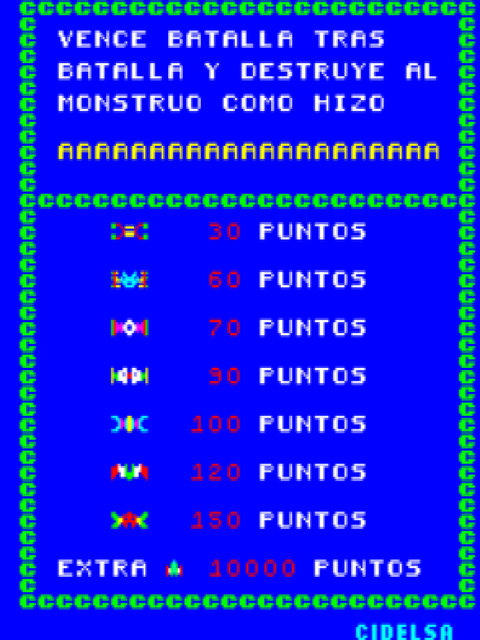
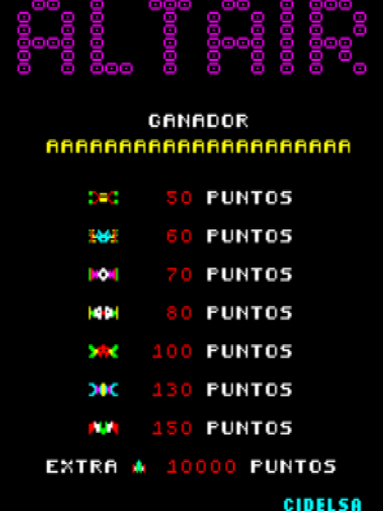
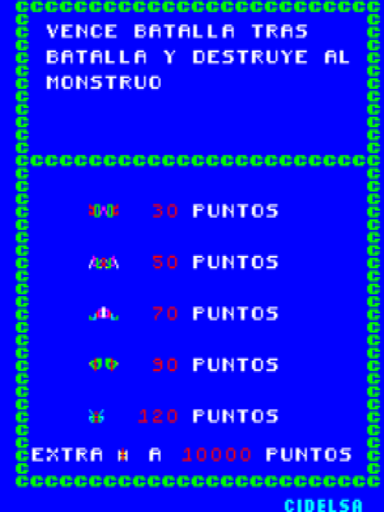
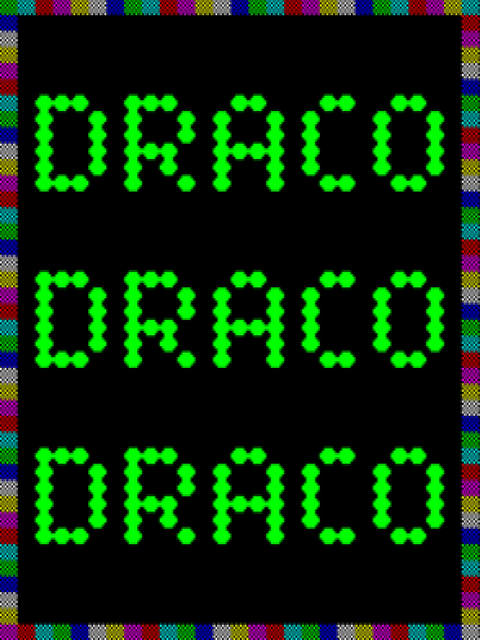

# cidelsa-fpga

Cidelsa arcade cores for **MiSTer**. · Cores arcade de **Cidelsa** para **MiSTer**.

<!-- MOSAICO:AUTO -->

## Vertical

<table>
<tr>
<td align="center" width="33%"><a href="DETAILS.md#status"></a><br><b>Altair</b> · 1981</td>
<td align="center" width="33%"><a href="DETAILS.md#status"></a><br><b>Altair II</b> · 198?</td>
<td align="center" width="33%"><a href="DETAILS.md#status"></a><br><b>Destroyer</b> · 1980</td>
</tr>
<tr>
<td align="center" width="33%"><a href="DETAILS.md#status"></a><br><b>Draco</b> · 1981</td>
</tr>
</table>

<!-- /MOSAICO:AUTO -->

<!-- INSTALAR:AUTO -->

## How to install the Cidelsa cores on your MiSTer FPGA

Two options:

1. **Download and copy them yourself.** The `.rbf` cores are in [`releases/`](releases/) and go to `_Arcade/cores/` on
   the SD card; the `.mra` files are there too and go to `_Arcade/`.
2. **Let the MiSTer Downloader do it.** Add the [jlrh-misterfpga-db](https://github.com/jlrh/jlrh-misterfpga-db)
   database to `downloader.ini` (root of the SD card) and run `Scripts → update`. It installs these cores **and the
   rest of jlrh's arcade cores** (Konami, Gaelco, Seibu, Inder…), and keeps them all up to date.

```ini
[jlrh/jlrh-misterfpga-db]
db_url = https://raw.githubusercontent.com/jlrh/jlrh-misterfpga-db/db/db.json.zip
```

**ROMs are not included.** Bring your own MAME romsets (merged, MAME 0.288) into `games/mame/`. The exact set each core
expects is in [`ROMS.md`](https://github.com/jlrh/jlrh-misterfpga-db/blob/main/ROMS.md).

**More:** hardware, status, controls and credits of each core in [`DETAILS.md`](DETAILS.md). Screenshots taken from MAME.

Written from scratch in Verilog on the MiSTer framework ([Template_MiSTer](https://github.com/MiSTer-devel/Template_MiSTer)).
License: GPLv3 ([`LICENSE`](LICENSE)).

## Cómo instalar los cores de Cidelsa en tu MiSTer FPGA

Dos opciones:

1. **Descargarlos y copiarlos tú.** Los `.rbf` están en [`releases/`](releases/) y van a `_Arcade/cores/` en la SD;
   los `.mra` también están ahí, y van a `_Arcade/`.
2. **Que lo haga el MiSTer Downloader.** Añade la base de datos
   [jlrh-misterfpga-db](https://github.com/jlrh/jlrh-misterfpga-db) a `downloader.ini` (en la raíz de la SD) y ejecuta
   `Scripts → update`. Instala estos cores **y el resto de cores arcade de jlrh** (Konami, Gaelco, Seibu, Inder…), y los
   mantiene todos al día.

```ini
[jlrh/jlrh-misterfpga-db]
db_url = https://raw.githubusercontent.com/jlrh/jlrh-misterfpga-db/db/db.json.zip
```

**Las ROMs no se incluyen.** Pon tus propios romsets de MAME (merged, MAME 0.288) en `games/mame/`. El set exacto que
espera cada core está en [`ROMS.md`](https://github.com/jlrh/jlrh-misterfpga-db/blob/main/ROMS.md).

**Más:** hardware, estado, controles y créditos de cada core, en [`DETAILS.md`](DETAILS.md). Capturas tomadas de MAME.

Escritos desde cero en Verilog sobre el framework de MiSTer ([Template_MiSTer](https://github.com/MiSTer-devel/Template_MiSTer)).
Licencia: GPLv3 ([`LICENSE`](LICENSE)).

<!-- /INSTALAR:AUTO -->
